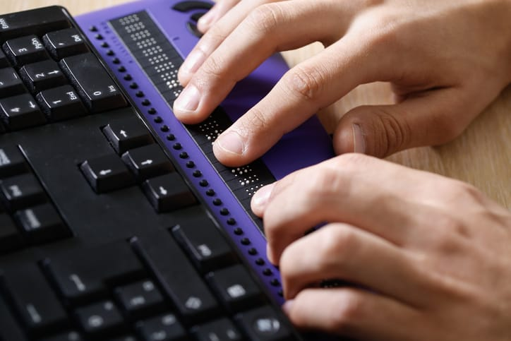
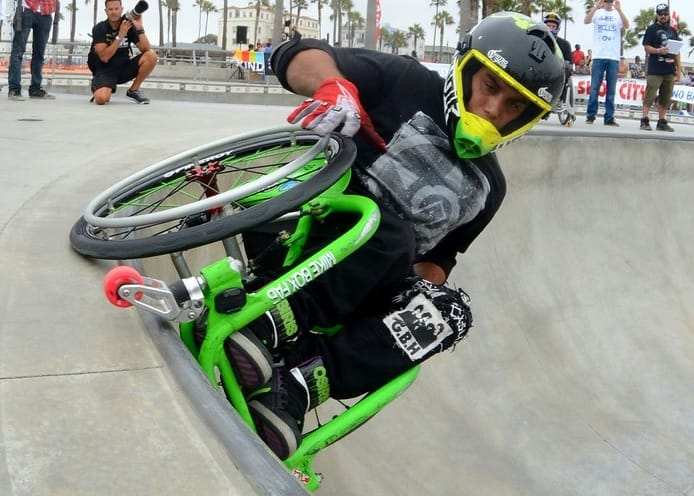
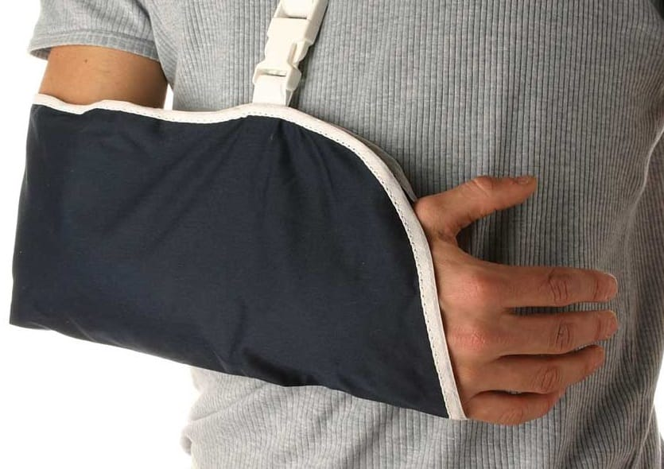

# Understanding Disabilities

Let's go a little more in-depth with each of the disabilities mentioned earlier to gain a clearer understanding of what they're about.

## Visual impairments

A visual impairment is anything that affects a person's ability to see clearly. In other words, if you don't have perfect 20/20 vision, you are considered to have a visual impairment.

**Q:** Does anyone here use any assistive technology to help with their vision? _(Glasses are assistive tech!)_

Some impairments can easily be corrected by simply wearing a pair of glasses or inserting contact lenses. Other impairments are more permanent, such as:

- **Low vision**

Difficulty seeing things clearly, which is common among the elderly, or due to genetics, traumatic injuries, or illnesses

- **Color blindness**

Which means some folks cannot perceive (see) the difference between certain color combinations

- **Legally blind**

Which doesn't necessarily mean someone can't see at all, but rather can only see light or vague shapes of objects

### Challenges and assistive technology

For visual impairments, some challenges include:

- People not being able to see the screen
- difficulty discerning color

Some assistive technology available to help consume content include:

- Glasses
- text zoom software
- screen reader
- braille reader

## Deafness / hard of hearing

The word **deaf** usually refers to an individual with very little or no functional hearing and who often uses sign language to communicate.

The term **Hard of Hearing** refers to an individual who has a mild-to-moderate hearing loss who _may_ communicate through sign language, spoken language, or both.

It's important to note that the term **Hearing Impaired** is considered offensive to those in the community as many do not consider themselves as being impaired. Rather, the terms "deaf" and/or "hard of hearing" are considered to be more positive.

### Challenges and assistive technology

For Deafness / hard of hearing, some challenges include:

- People not being able to hear video or audio content

Some assistive technology available to help consume content include:

- Hearing aid
- captions/audio descriptions
- transcripts

## Motor disabilities

Motor disabilities are those which affect physical capabilities. These often lead to difficulties using `input` devices, such as a mouse or trackpad, and interacting with user interfaces.

Examples include but are not limited to:

- **Paraplegia or quadriplegia**, a state of paralysis of the limbs, due to spinal cord injuries
- **Cerebral palsy**, an injury to the brain resulting in decreased muscle control
- **Parkinson's disease**, a disorder of the central nervous system that causes uncontrollable tremors

For people with motor disabilities, ensuring full keyboard support is key to successfully navigating and completing tasks.

### Challenges and assistive technology

For Motor disabilities, some challenges include:

- Being accurate with interactions
- using a mouse
- interacting with small UI elements

Some assistive technology available to help consume content include:

- Keyboard
- voice dictation software
- wand mouth stick
- switch device

## Vestibular issues / seizure disorders

For people with a **Vestibular disorder**, which is an issue with parts of the inner ear and brain that help control balance and eye movement, it is a common occurrence to experience feelings of dizziness or Vertigo which may be a result of animated or moving objects on the screen.

There are other folks who are susceptible to **seizures** which are caused by strobing, flickering, or flashing effects.

With this in mind, it's a good idea to keep animations on the web to a minimum.

### Challenges and assistive technology

For Vestibular and seizure disorders, some challenges include:

- Navigating a web with an increasing amount of animation
- no warning of flashing content

Some assistive technology available to help consume content include:

- Using "reader mode" to remove animations
- "Reduce motion" operating system feature

## Cognitive disabilities

There are many different types of cognitive disabilities. Clinical diagnoses of cognitive disabilities including but not limited to:

- Autism
- Down Syndrome
- Dementia/Alzheimer's

Less severe cognitive conditions might include:

- Attention deficit disorder (ADD)
- Dyslexia (difficulty reading)
- Learning disabilities

### Challenges and assistive technology

For Cognitive disabilities, some challenges include:

- Reading content
- understanding design patterns
- completing timed tasks
- general focus

Some assistive technology available to help consume content include:

- Using "reader mode" to remove distractions
- [Kurzweil](https://www.kurzweiledu.com/) software, a piece of software which helps to increase reading comprehension for for those with a learning disability

## Temporary disabilities

So far we've discussed many disabilities which can considered permanent. However, there is such a thing as a temporary disability. Perhaps you know someone or you yourself have been in a situation where you have limited abilities for a short term.

Consider the following situations:

- A broken arm or finger which limits your ability to only use one arm/hand
- Trying to read text on your phone while outside in the sun—contrast!
- A loud, busy area such as a bus terminal or train station might limit your cognitive thought process
- Having Lasik eye surgery limits your vision for a period of time
- Traveling to a new country and not understanding the local spoken language or street signs
- Holding a baby in one arm while trying to look something up on your phone with the other!

The point here is that, temporary or permanent, designing with accessibility in mind really helps everyone in any type of situation.

> Make accessibility considerations for all disabilities to provide an inclusive user experience.

One of the key takeaways is to know that accessibility on the web is _not_ just about figuring out how to make our content usable for screen readers, as this is what most people consider when they think of "accessibility" for the web. Really though, screen readers are just the tip of the iceberg.

Accessibility considerations need to be made for all disabilities in order to provide a truly inclusive user experience.
