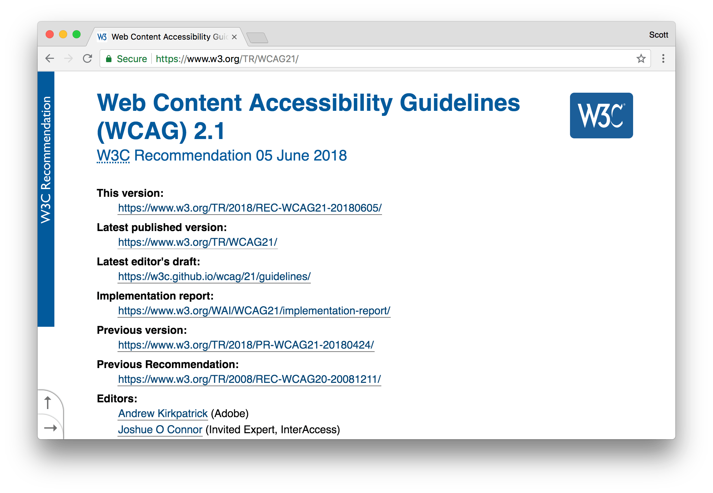
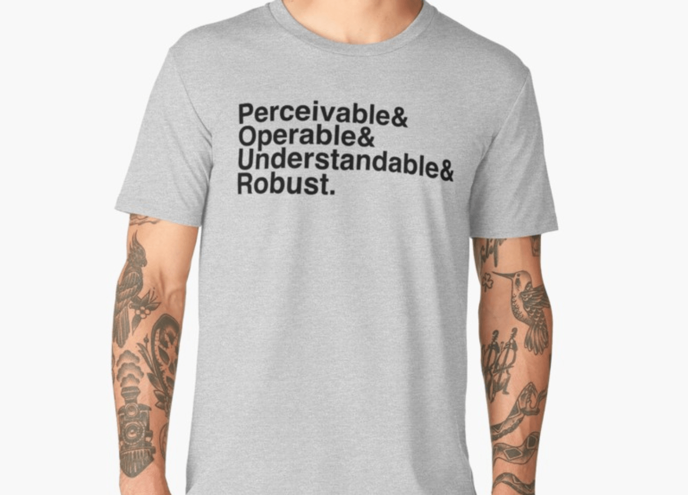
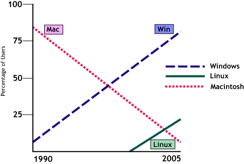
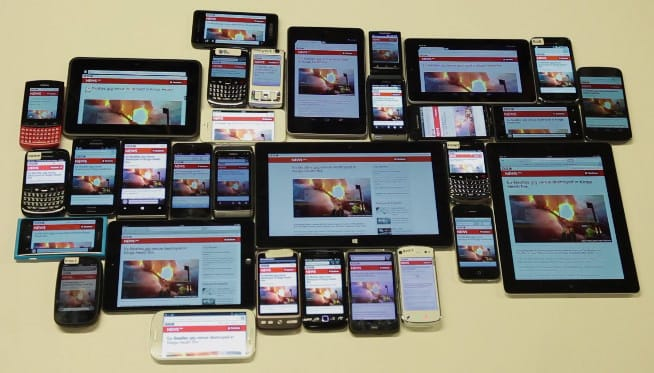

# The four principles of accessibility

Before we dive in to the workshop content, it's important discuss and understand where the recommendations for each issue is coming from.

All of the recommendations on accessibility best practices are derived from four base principles which help to provide the foundation of things web accessibility. When working together, each of of the four principles and their concepts help to ensure an accessible user experience.

Right before we get into the principles and their definitions, it's good to know where they come from and who is responsible for the creation of and maintainance of this information.

## W3C, WAI, WCAG

The [World Wide Web Consortium](https://w3.org/) (W3C) is an international community that develops open standards to ensure the long-term growth of the web. These standards include things such as the HTML and CSS specifications, as well as standards for web payments, commerce, and security.

One key group formed from the W3C is the [Web Accessibility Initiative](https://www.w3.org/WAI/) (WAI). This group is responsible for creating new content for and maintenance of the [Web Content Accessibility Guidelines](https://www.w3.org/TR/WCAG21/).

WCAG (also pronounced "wuh-cag") is a world-wide recognized standard for testing and implementing accessible user experiences for people with disabilities. It's used for desktop web, mobile web and native apps, and pretty much any type of digital content.

## P.O.U.R.

The basis of each accessibility recommendation or best practice is actually derived from one of the four principles of accessibility. Each principal represents a set of guidelines which are to be followed in order to create a usable and accessible experience.

At a high-level, the principals include:

- Perceivable
- Operable
- Understandable
- Robust

So, let's look at these in more detail individually to see what they're all about.

### Perceivable

**Perceivable** — Information and user interface components must be presentable to users in ways they can perceive (become aware or conscious of something; come to realize or understand how something works.) Examples include:

- Short text equivalents for images, including icons, `button`s, and graphics;
- Description of data represented on charts, diagrams, and illustrations;
- Brief descriptions of non-text content such as audio and video files;
- `label`s for form controls, `input`, and other user interface components.

In other words, content needs to be available to at least one of the user's four senses

For example, if you have a visual impairment, can you see the content by zooming in on the content, does it have enough color contrast to be readable? If you're blind, does your screen reader work well with the content provide?

If you're deaf, is there a text alternative for that piece of audio content?

We need to make sure people can be made aware of and understand the content presented to them.

### Operable

**Operable** — User interface components and navigation must be operable or usable (the interface cannot require interaction that a user cannot perform). This means user interfaces require keyboard access to all functionality. Keyboard accessibility includes:

- All functionality that is available by mouse is also available by keyboard;
- Keyboard focus does not get trapped in any part of the content;
- Web browsers, authoring tools, and other tools provide keyboard support.

In other words, people need to be able to operate the web site. Not everyone uses or is capable of using a mouse so they may only use a keyboard or perhaps voice recognition software to announce commands.

### Understandable

**Understandable** — Information and the operation of user interface must be understandable or easily comprehensible. Content authors need to ensure that text content is readable and understandable to the broadest audience possible, including when it is read aloud by text-to-speech software. Such content includes:

- Identifying the primary language of a web page, such as Arabic, Dutch, or Korean;
- Providing definitions for any unusual or uncommon words, phrases, idioms, and abbreviations;
- Using the clearest and simplest language possible, or providing simplified versions.

So making sure interfaces and content is clear, consistent, and predictable is key for making sure someone is able to understand and use your service.

### Robust

**Robust** — Content must be robust and created in a way which can be interpreted reliably by a wide variety of user agents, including assistive technologies. In other words. robust content is compatible with different browsers, assistive technologies and devices, kiosks, phones, toasters, any networked device. Examples of how this can be achieved include:

- Ensuring markup can be reliably interpreted, for instance by ensuring it is valid;
- Providing a name, role, and value for non-standard user interface components.

So, for example, can a older, mobile browser reliably output the same content as seen on a modern desktop browser? Does the content work well with a screen reader or braille reader?

## WCAG Success Criteria

Each of the four principles is made up of several success criteria. These criteria make up the conformance tests you need to be conducting in order to create an accessible user experience.

There are three levels of conformance, each increasing in the level of difficulty in order to meet the required success criteria tests. The breakdown of each level is as follows:

- Level A

  > Provides a baseline to meet basic usability needs of most people

- Level AA

  > Includes usability which meets the needs of most people with disabilities

- Level AAA
  > Success criteria to meet the needs of all people and beyond

The typical level to strive for in order to meet the needs of people with disabilities and to conform with most regional laws is WCAG 2.0 Level AA. This level provides a balance of usability, functionality, and aesthetic design that's achievable by designers and developers the world over.

> If any of these principles are not met, users with disabilities will not be able to use the web.

What all this means is, if any of these principles and guidelines are not met, users with disabilities will not be able to use the web. If someone's not able to understand our content, if they're not able to use the products we create on the device that they have available, using the assistive technology they require to live their daily lives, then we have a problem.

Let's do our best to avoid creating these barriers.
