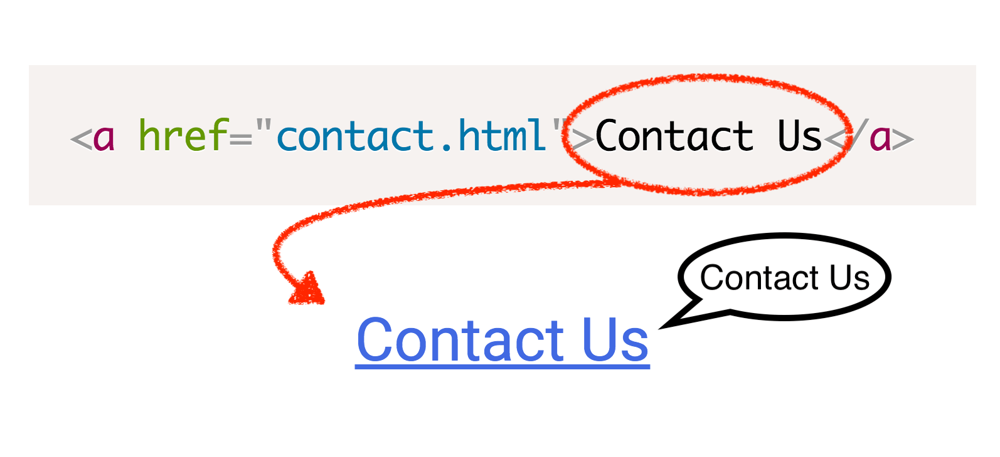
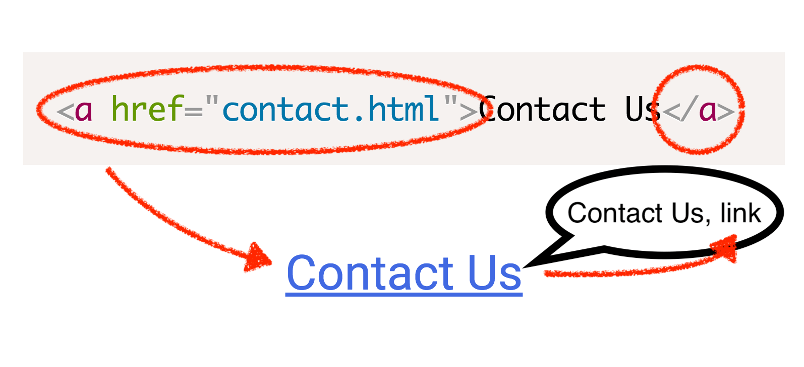
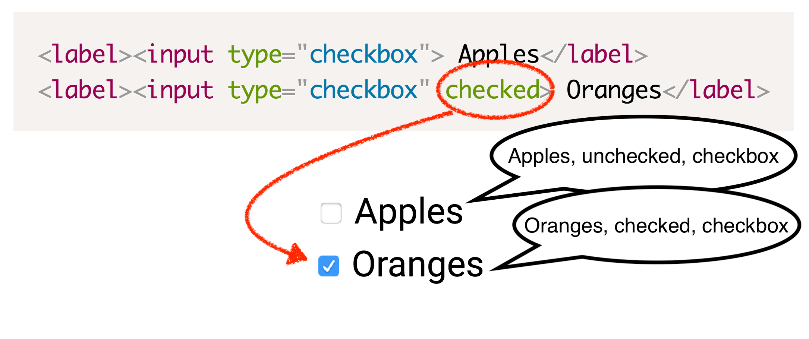

# Semantic HTML

Every HTML element serves a purpose. The purpose is conveyed through it's semantic meaning. As a quick example, an link element's semantic meaning is conveyed as, "link". A button element is conveyed as, "button". As a result, people will understand and know what to expect when interacting with these elements.

> Semantic HTML is the foundation of an accessible experience.

Writing semantic HTML is really the foundation of creating an accessible experience. It means using native browser elements and controls in order to convey the meaning and purpose of our content.

This is how people who use and rely on screen readers and other assistive technology know how to navigate and consume your site content and what to expect when interacting with an element.

In doing so you answer the question for the user…

> What is this thing and what does it do?

The semantics of an element are very important to keep in mind when writing HTML. Understanding when and how to use HTML elements is not always easy, but correct implementation will result in a positive and successful user experience for people who depend on assistive technology.

## Semantics include…

There's information that needs to be present when an element receives keyboard focus in order for someone using a screen reader to navigate and consume that content.

For example, naturally focusable elements include links, buttons, and other form controls, and when the element is in focus, its text content and related attributes are read out loud to screen reader users, describing what it is they're currently interacting with.

What's actually announced is:

- The element's accessible name or text equivalent
- The element role
- The current state of the element (if applicable)

## The accessible name/label/text equivalent

The accessible name is the part that describes what the element is for, its purpose for being.

This is usually found as the content between the start and end tags of an HTML element. It could also be the alternative text value for an image `alt` attribute, or the `label` associated with a form input.

Let's take for instance, a link. This element has text between its start and end tag. This text gets read aloud by a screen reader when it receives keyboard focus. In doing so, this conveys context on what should happen or where the browser should go when that link is activated.

For example, a link in a navigation area with the accessible name of "Contact Us" would indicate that, if you activated that link, it would load a page with contact information, maybe a telephone number or address, and possibly a form where someone could send a message.

### The element role

The element's role informs the user of a few things, including what the element does and how to interact with it.

Coming back to the link example, the role announced when the link receives keyboard focus would be _"link,"_ as links are structured with opening and closing `a` tags and include a valid `href` attribute. The expected result or, "what it does," would be for the browser to either load a new page or jump to another section of the same page, shifting focus to a different element. How to interact with the link would be for the user to press the `Enter` key, as this is also a part of the semantics of a link.

Various element roles come with expectations on how to use them. Depending on the role, a user might expect they would need to press the `Enter` key to continue (as is the case with a link), use the `Space` key to activate a button, or perhaps use the Up-arrow or Down-arrow keys to make a selection when interacting with a `select` element.

### The current state

In addition to the name and role, depending on the element at hand, there could also be a state announcement.

Announcing the state helps to convey the current condition of the element, whether interaction is needed, and what might happen when the interaction takes place.

For example, checkboxes and radio buttons have a "checked" or "unchecked," and a "selected" or "unselected" state, respectively.

An accordion style widget would have an "expanded" or "collapsed" state, indicating whether the content is on-screen and available for consumption (expanded), or if the content section will merely be skipped over when navigation continues (collapsed).

> Using semantic HTML is setting up your users for success.

Semantic HTML conveys the message of what the currently focused element is, what it might do, and how to interact with it. In order to create an inclusive experience, it's important to understand the semantic meaning of HTML elements, know when the appropriate time is to use them, and how to accurately pass the message along to the user of what the element is for.

Keep all this in your mind as we go through the rest of the content in the workshop.

## ✅ [1.3.1 Info and Relationships](https://www.w3.org/WAI/WCAG21/Understanding/info-and-relationships.html)

This comes back to 1.3.1 Info and Relationships which states

> "Information, structure, and relationships conveyed through presentation can be programmatically determined or are available in text."
