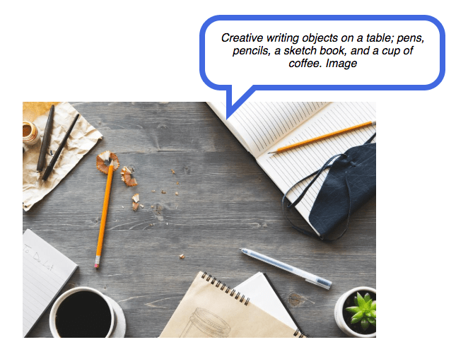
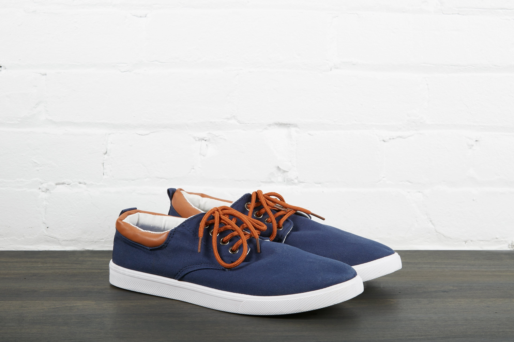

# Image `alt` text

`alt` text, or "alternative text" as the long-form name suggests, is a written text description for an image on the web. It helps to describe the image for the reader to understand what the image is about.

In other words, `alt` text is content. And like any other content on your site, it should be well written and constructed, ready for consumption.

## Who benefits from `alt` text?

There are a few situations where writing alt text and including well formed descriptions for your imagery is beneficial for a successful website, including search engine optimization and sighted users who are able to read the content when and if an image fails to load.

However, it's actually people who use and rely on assistive technology who have the most to gain when interacting with non-text content on the web.

`alt` text provides people with visual impairments the ability to participate in consuming non-text content.

When assistive technology, such as a screen reader, encounters an image on the web, the `alt` text is read and announced aloud. By doing so, someone who relies on this technology can still have a clear understanding of what the image represents and be included in the conversation.

## Images missing the `alt` attribute

When writing HTML code, it's important to always include the `alt` attribute on an image element. Without this attribute, you risk running into some issues:

- Without an `alt` attribute, your HTML markup is considered invalid and may result in an inconsistent user experience.
- When a screen reader encounters an `img` element without the `alt` attribute, the `src` attribute value is announced. This is often not helpful and can be regarded as a poor user experience.

With this in mind, whether you're working with Wordpress, React, or plain HTML, remember to _always_ include the `alt` attribute when including an image in code.

## When to include `alt` text

You might be tempted to always include some sort of text within the `alt` attribute in order to cater for the cases outlined above. However, the fact remains that not every image should have a value set for its `alt` attribute.

How do we know when to include `alt` text for our images? Here are three common situations to consider if `alt` text should be added or if the alt attribute should be set as empty.

1. If the image itself contains text, such as a logo or an inspirational quote embedded within the image, the `alt` attribute value should be an exact match of the visible text.
2. If the image doesn't add any valuable content to the article, or is adjacent to related text content, the `alt` attribute value should be left empty. This results in screen readers bypassing the image altogether as it is considered a "decorative" image.
3. If the image is considered to add content or value to the article, add descriptive `alt` text.

There are more examples and situations to consider. For a more comprehensive list, check out the tutorial, [An `alt` Decision Tree](https://www.w3.org/WAI/tutorials/images/decision-tree/).

## How to write `alt` text

- Be accurate and descriptive
- Don't overwhelm with too much information

Writing high quality, descriptive alt text may not be as easy as it seems. A quick one-liner of "Cat on couch," "white shoes," or "group of people," doesn't quite do the trick of painting a mental picture.

On the flip side, it is possible to overwhelm someone with too much descriptive text. Getting that fine line of descriptive precision is something of a skill master.

As a test, let's write some alt text for this image:

For this image, an accurate description might be something like:

> "A pair of low-top shoes are placed on top of a dark-brown table in front of a white brick wall. The shoes are mostly dark blue with a white midsole, brown laces, a black back tab, and white lining."

This description is pretty accurate, but a little too wordy. Since we're describing a product we can focus directly on the product's physical features.

Let's cut the description back to just the essential, such as:

> "Dark blue, low-top shoes with white midsole, brown lace, black back tab, and white lining."

This `alt` text does the trick; it describes the image in a clear and precise manner, not overwhelming someone as they take in the content. The general recommendation is to keep `alt` text to around 100 characters in order to hit that fine line of "just enough" content.

### ✅ [1.1.1 Non-text Content](https://www.w3.org/WAI/WCAG21/Understanding/non-text-content.html)

This comes back to WCAG 1.1.1 Non-text Content which states

> "All non-text content that is presented to the user has a text alternative that serves the equivalent purpose."

## Exercise!

1.  In your browser and editor, load: `website/blog-post.html`.
2.  Pick a photo and try writing some `alt` text describing the image.
3.  **Bonus!** Use your screen reader virtual cursor to listen to your `alt` text.
