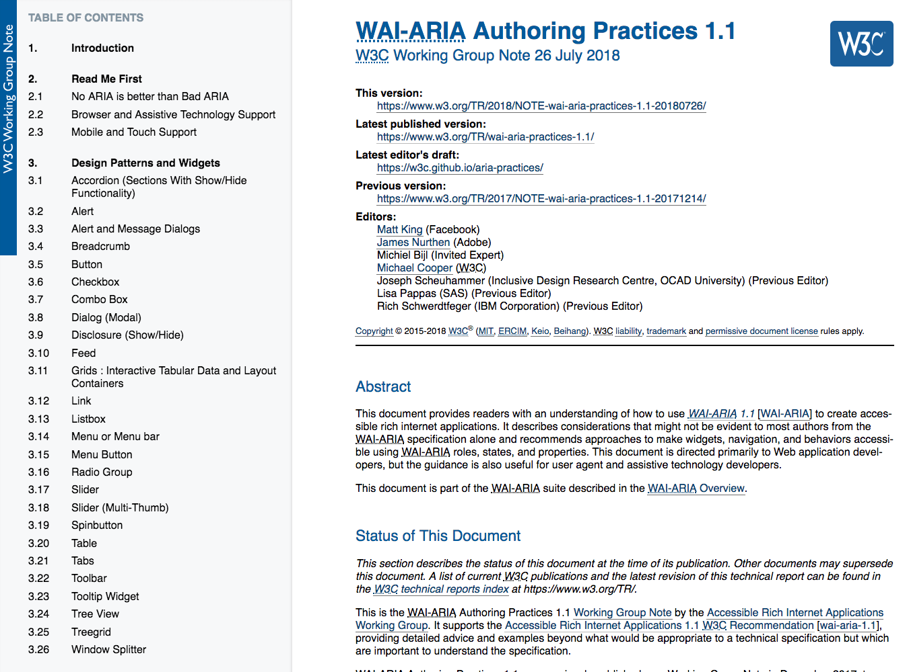
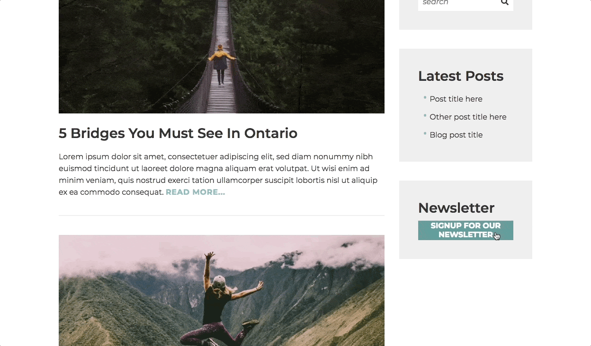

# Dynamic components

For dynamic content and non-native components, such as date pickers, modal windows, autocomplete fields, extra care needs to be taken in order to ensure an accessible user experience.

As we've previously discussed, ARIA can be used to help convey meaning and set expectations when interacting with highly dynamic components. It acts as a bridge between non-native HTML elements and assistive technologies by generating semantic meaning for custom components.

When the requirement arises to implement such a component, how do we know exactly which ARIA attributes to use on which HTML elements? What is the expectation for keyboard interaction?

[](https://www.w3.org/TR/wai-aria-practices-1.1/)

We have available to us an official W3 guide to help in this very situation: [WAI-ARIA Authoring Practices](https://www.w3.org/TR/wai-aria-practices-1.1/).

The ARIA Authoring Practices guide is broken down into various components. Each component specifies how to apply ARIA attributes, how someone might use a keyboard to interact with the component, and sometimes provides fully working examples.

So, let's go through and review the best practices when creating a **modal window** component.

## Modal window



A modal window is a common component used in order to bring something important to the user's attention. It's often represented visually with a small portion of content right in the middle of the screen with the rest of the page content "below" or "behind" the modal content with a darkened overlay. Essentially this visual representation states to the user, _"Put whatever it was you were doing on hold as this content is really important. Please provide your full attention on me for now."_

When it comes to interacting with a modal window, someone using a mouse can either dismiss the window by clicking the close button, clicking a call-to-action button (usually "Ok" or "Cancel"), or sometimes the darkened overlay itself can be interacted with to dismiss.

However, when it comes to someone using just the keyboard, how can we ensure the expected interactions are available to successfully navigate a modal window? What are the expected interactions? How do we convey the information needed to inform a screen reader user, someone who may not be able to see the modal window visual, of the current context they're interacting with?

Let's look through the Authoring Practices guide on creating a modal window; the expected keyboard interaction, managing focus, and adding the appropriate ARIA attributes.

### Keyboard interaction

The expected keyboard support is as follows.

**When pressing `Tab`**

- Moves focus to the next focusable element inside the modal window.
- If keyboard focus is on the **last** focusable element inside the modal, the next `Tab` keypress moves focus to the **first** focusable element inside the modal

**When pressing `Shift` + `Tab`**

- Moves focus to the previous focusable element inside the modal window.
- If focus is on the **first** focusable element inside the modal, the next `Shift` + `Tab` keypress moves focus to the **last** focusable element inside the modal.
- When `Esc` is pressed, the modal window is dismissed.

### Focus management

Focus management is a method used to willfully and purposefully move the keyboard cursor from one element to another on behalf of the user. This technique is sometimes required to guide the user with the intended flow of the app.

Focus management should only be used when absolutely necessary as to not create more work for the user when an unexpected shift in focus has occurred. (When to shift focus is pointed out in the ARIA best practices guide.)

Let's review the required focus management for an accessible modal window component.

1. When the user activates the launcher control (typically a `button` element but could also be an link depending on the context), the keyboard focus will shift from the control to the modal window container.
2. As pointed out in the previous section, keyboard focus should remain within the modal window when using `Tab`, `Shift` + `Tab` or the screen reader virtual cursor to navigate.
3. When the modal window is dismissed, focus should return to the control which launched the window. This way, the user can carry on with their task right where they left off.

### ARIA roles, states, and properties

When someone using a screen reader encounters a modal window, they need to know what it is they're currently navigating and interacting with. The method to share this information is through applying ARIA attributes to specific HTML elements.

| Element               | Attribute                 | Usage                                                                                                                                            |
| --------------------- | ------------------------- | ------------------------------------------------------------------------------------------------------------------------------------------------ |
| Launcher `button`     | `aria-haspopup="modal"`   | Informs the user of a modal context upon interaction                                                                                             |
| Modal container `div` | `role="dialog"`           | Identifies the current container and context as a modal window                                                                                   |
| Modal container `div` | `aria-labelledby="IDREF"` | Helps to describe the purpose of the modal window by referencing the `h2` heading element — if no heading is available, use `aria-label` instead |
| Modal container `div` | `aria-modal="true"`       | Informs assistive technologies that the content underneath the current dialog are not available for interaction                                  |

## Keyboard trap?

So far we've established some of the requirements for the modal window; ARIA attributes, focus management, and the expected keyboard interactions. One other important piece is enforcing or "trapping" the keyboard cursor to the modal window itself. How do we accomplish this?

This used to be quite a complex task to write in JavaScript; selecting all focusable elements within the modal, tracking the visible state, ensuring the last item receives focus if the first is tabbed past, and more. Thankfully, modern development practices and advancements in HTML are happening to help make this pattern much easier to write.

### The `inert` attribute

To handle trapping the keyboard we can use the `inert` attribute. When the `inert` attribute is applied to a container, all child elements that are naturally keyboard focusable are removed from the natural tab order. In other words, they are no longer focusable. In a way it's almost the same as if applying CSS `display: none` to the container, except the content is still visible in a "read-only" state.

Since the `inert` attribute is not officially part of the HTML specification, we can use the [WICG inert polyfill](https://github.com/WICG/inert) for the time being. This polyfill is being actively worked on and has solid support behind it. Eventually, this attribute will be a part of the HTML spec and will be included in browsers for general use.

#### Using `inert`

Apply the `inert` attribute to any container element which should be "removed" from being keyboard ad assistive technology accessible.

```html
<header inert><!-- … --></header>

<main inert><!-- … --></main>

<footer inert><!-- … --></footer>

<div class="modal" …><!-- … --></div>
```

For example, with a modal window content, apply the `inert` attribute to content containers other than the modal window. This will ensure users can still interact with modal content. That said, it's best to generate the modal window HTML container as a sibling to all other containers on the page. This way you can apply the `inert` attribute to those elements and skip past the modal window itself.

## Exercise!

1.  In your browser, load: `website/popup.html`
2.  In your editor of choice, load: `website/modal-window.js`
3.  Add the JavaScript code to make the "Sign up for our newsletter" modal accessible!
4.  **Bonus!** There are other issues to fix — can you find them?
